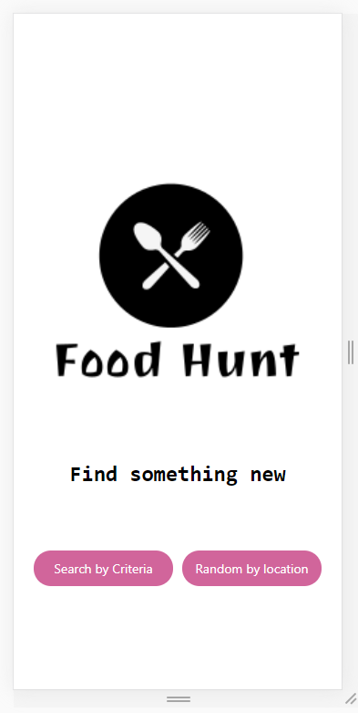
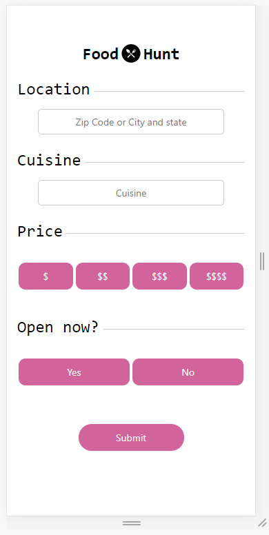
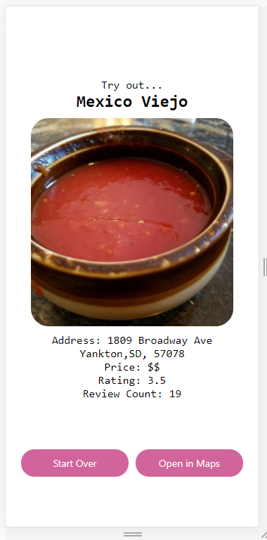
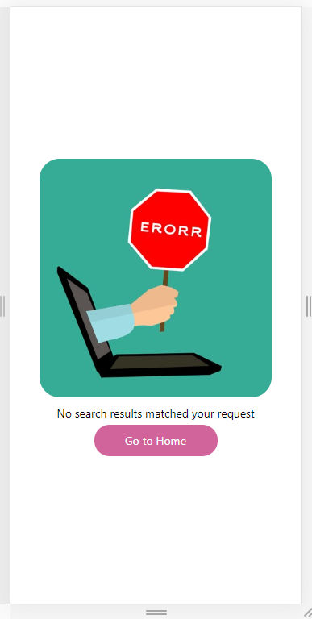
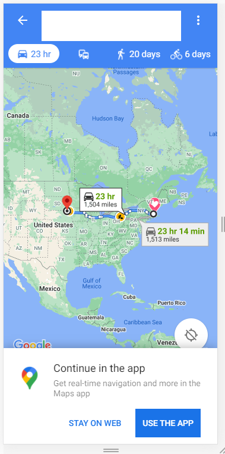

# Food Hunt

Food Hunt is an app built with the idea that if you can't decide where to eat, this app can do the deciding for you.
  - Prompts user for criteria such as location, cuisine, price, and whether or not a restaurant is open
  - Can use user's current location to get a random nearby restaurant
  - Able to open maps with directions to location straight from the app.
  - Queries Yelp API and randomizes what restaurant results are yielded
  - Works for Android, iOS, and web

## Screenshots
Here are some screenshots to showcase what the app itself looks like.

#### Main Menu
What the users sees on launch of the application  

#### Questionnaire Form
When the user wishes to search with certain criteria, this is the form that is displayed  

#### Results
The view the user sees when a restaurant is randomly selected, abiding by any given criteria  

#### Error
If there is no restaurant able to be selected, possibly because no valid results are returned from the Yelp API, then this screen shows up (yes, I know that "error" is spelled incorrectly here but I liked the picture anyway)  

#### Maps View
If the user finds a restaurant, they can opt to open the location in maps. This gives directions from the users current location to the destination.  

